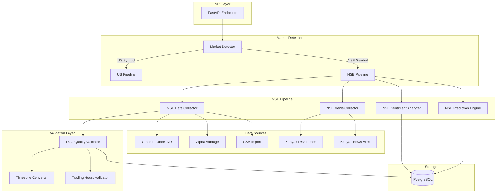

# Design Document: NSE Market Adaptation

## Overview

This design document specifies the technical architecture for adapting the Stock Market Prediction System to support the Nairobi Securities Exchange (NSE) alongside the existing US market support. The system will maintain a multi-market architecture that allows simultaneous operation of US and NSE stock tracking, prediction, and sentiment analysis.

### Goals

1. **Multi-Market Support**: Enable the system to handle both US and NSE markets with market-specific data sources, trading hours, and currencies
2. **NSE Data Integration**: Integrate multiple data sources (Yahoo Finance with .NR suffix, Alpha Vantage, CSV import) for NSE stock data
3. **Kenyan News Integration**: Collect and analyze financial news from Kenyan media sources
4. **Data Quality**: Implement comprehensive validation pipeline for NSE market data
5. **Timezone Handling**: Properly handle EAT (UTC+3) timezone for NSE operations
6. **Backward Compatibility**: Maintain full compatibility with existing US stock functionality

### Non-Goals

- Real-time streaming data (batch collection remains the primary mode)
- Support for markets other than US and NSE in this phase
- Currency conversion between KES and USD
- Intraday trading predictions (focus remains on daily predictions)

### Key Design Decisions

1. **Market Detection Strategy**: Use symbol format (.NR suffix) to automatically detect NSE stocks rather than requiring explicit market parameter
2. **Data Source Hierarchy**: Yahoo Finance primary, Alpha Vantage fallback, CSV import for manual data
3. **Database Schema**: Add market identifier and currency fields to existing tables rather than creating separate tables per market
4. **Configuration-Driven**: Use configuration files for news sources, holidays, and data sources to enable changes without code deployment
5. **Validation Pipeline**: Implement a multi-stage validation pipeline that checks data quality at ingestion time

## Architecture

### High-Level Architecture



### Component Architecture

The system follows a layered architecture:

1. **API Layer**: FastAPI endpoints that accept stock symbols and route to appropriate market pipeline
2. **Market Detection Layer**: Analyzes symbol format to determine market (US vs NSE)
3. **Pipeline Layer**: Market-specific pipelines for data collection, sentiment analysis, and prediction
4. **Validation Layer**: Multi-stage validation for data quality, timezone, and trading hours
5. **Storage Layer**: PostgreSQL database with market-aware schema

### Market Detection Flow

```mermaid
sequenceDiagram
    participant Client
    participant API
    participant Detector
    participant NSEPipeline
    participant USPipeline
    
    Client->>API: Request data for "SCOM.NR"
    API->>Detector: Detect market("SCOM.NR")
    Detector->>Detector: Check for .NR suffix
    Detector->>API: Return "NSE"
    API->>NSEPipeline: Route to NSE pipeline
    NSEPipeline->>Client: Return NSE data
    
    Client->>API: Request data for "AAPL"
    API->>Detector: Detect market("AAPL")
    Detector->>Detector: No .NR suffix
    Detector->>API: Return "US"
    API->>USPipeline: Route to US pipeline
    USPipeline->>Client: Return US data
```



## Components and Interfaces

### 1. Market Detector

**Purpose**: Automatically detect market type based on stock symbol format

**Interface**:
```python
class MarketDetector:
    @staticmethod
    def detect_market(symbol: str) -> MarketType:
        """
        Detect market type from symbol format.
        
        Args:
            symbol: Stock symbol (e.g., "SCOM.NR", "AAPL")
            
        Returns:
            MarketType enum (US or NSE)
        """
        pass
    
    @staticmethod
    def normalize_symbol(symbol: str, market: MarketType) -> str:
        """
        Normalize symbol to standard format.
        For NSE: ensure .NR suffix
        For US: remove any suffixes
        
        Args:
            symbol: Raw symbol input
            market: Detected or specified market
            
        Returns:
            Normalized symbol string
        """
        pass
```

**Implementation Notes**:
- Check for `.NR` suffix to identify NSE stocks
- Default to US market if no suffix present
- Case-insensitive detection
- Validate symbol format after detection

### 2. NSE Symbol Parser

**Purpose**: Parse and validate NSE stock symbols

**Interface**:
```python
class NSESymbolParser:
    VALID_SYMBOLS: Set[str] = {
        "SCOM", "KCB", "EQTY", "EABL", "COOP",
        # ... additional NSE symbols
    }
    
    @staticmethod
    def parse(symbol: str) -> NSESymbol:
        """
        Parse NSE symbol into components.
        
        Args:
            symbol: Symbol string (e.g., "SCOM.NR" or "SCOM")
            
        Returns:
            NSESymbol dataclass with base and suffix
            
        Raises:
            ValueError: If symbol format is invalid
        """
        pass
    
    @staticmethod
    def validate(symbol: str) -> bool:
        """
        Validate NSE symbol against whitelist and format rules.
        
        Rules:
        - Base symbol: 2-6 uppercase letters
        - Must be in VALID_SYMBOLS set
        - Suffix must be .NR if present
        
        Args:
            symbol: Symbol to validate
            
        Returns:
            True if valid, False otherwise
        """
        pass
    
    @staticmethod
    def format(base: str) -> str:
        """
        Format symbol for display (adds .NR suffix).
        
        Args:
            base: Base symbol (e.g., "SCOM")
            
        Returns:
            Formatted symbol (e.g., "SCOM.NR")
        """
        pass
```

**Data Structure**:
```python
@dataclass
class NSESymbol:
    base: str  # e.g., "SCOM"
    suffix: str = ".NR"
    
    def __str__(self) -> str:
        return f"{self.base}{self.suffix}"
```

### 3. NSE Data Collector

**Purpose**: Collect historical and current OHLCV data for NSE stocks

**Interface**:
```python
class NSEDataCollector:
    def __init__(self, config: NSEDataSourceConfig):
        self.primary_source = YahooFinanceNSE(config)
        self.fallback_source = AlphaVantageNSE(config)
        self.csv_importer = CSVImporter()
        
    async def fetch_historical(
        self,
        symbol: str,
        start_date: date,
        end_date: date,
    ) -> List[OHLCVRecord]:
        """
        Fetch historical OHLCV data with fallback logic.
        
        Args:
            symbol: NSE symbol (e.g., "SCOM.NR")
            start_date: Start date for data collection
            end_date: End date for data collection
            
        Returns:
            List of OHLCV records
            
        Raises:
            DataSourceError: If all sources fail
        """
        pass
    
    async def fetch_current_price(self, symbol: str) -> float:
        """
        Fetch most recent closing price.
        
        Args:
            symbol: NSE symbol
            
        Returns:
            Current price in KES
        """
        pass
```

**Data Source Implementations**:

```python
class YahooFinanceNSE:
    """Yahoo Finance adapter for NSE stocks using .NR suffix"""
    
    async def fetch(self, symbol: str, start: date, end: date) -> List[OHLCVRecord]:
        """
        Fetch data from Yahoo Finance.
        Symbol format: SCOM.NR
        """
        pass

class AlphaVantageNSE:
    """Alpha Vantage adapter for NSE stocks"""
    
    async def fetch(self, symbol: str, start: date, end: date) -> List[OHLCVRecord]:
        """
        Fetch data from Alpha Vantage API.
        Uses TIME_SERIES_DAILY function.
        """
        pass

class CSVImporter:
    """Import NSE data from CSV files"""
    
    def import_file(self, filepath: Path, symbol: str) -> List[OHLCVRecord]:
        """
        Import OHLCV data from CSV.
        Expected columns: date, open, high, low, close, volume
        """
        pass
```

### 4. Timezone Handler

**Purpose**: Handle timezone conversions between EAT and UTC

**Interface**:
```python
class TimezoneHandler:
    EAT = timezone(timedelta(hours=3))  # UTC+3
    
    @staticmethod
    def to_eat(dt: datetime) -> datetime:
        """Convert datetime to EAT timezone"""
        pass
    
    @staticmethod
    def to_utc(dt: datetime) -> datetime:
        """Convert datetime to UTC timezone"""
        pass
    
    @staticmethod
    def now_eat() -> datetime:
        """Get current time in EAT"""
        pass
    
    @staticmethod
    def format_eat(dt: datetime) -> str:
        """Format datetime with EAT timezone indicator"""
        pass
```

### 5. Trading Hours Validator

**Purpose**: Validate operations against NSE trading hours and holidays

**Interface**:
```python
class TradingHoursValidator:
    TRADING_START = time(9, 0)  # 9:00 AM EAT
    TRADING_END = time(15, 0)   # 3:00 PM EAT
    TRADING_DAYS = [0, 1, 2, 3, 4]  # Monday-Friday
    
    def __init__(self, holidays_config: Path):
        self.holidays = self._load_holidays(holidays_config)
    
    def is_trading_hours(self, dt: datetime) -> bool:
        """
        Check if datetime is within NSE trading hours.
        
        Args:
            dt: Datetime in EAT timezone
            
        Returns:
            True if within trading hours, False otherwise
        """
        pass
    
    def is_trading_day(self, dt: datetime) -> bool:
        """
        Check if date is a trading day (not weekend or holiday).
        
        Args:
            dt: Datetime in EAT timezone
            
        Returns:
            True if trading day, False otherwise
        """
        pass
    
    def is_market_open(self) -> bool:
        """Check if NSE market is currently open"""
        pass
    
    def next_trading_day(self, dt: datetime) -> datetime:
        """Get next trading day after given datetime"""
        pass
```

**Holidays Configuration**:
```yaml
# nse_holidays.yaml
holidays:
  - date: "2024-01-01"
    name: "New Year's Day"
  - date: "2024-04-19"
    name: "Good Friday"
  - date: "2024-05-01"
    name: "Labour Day"
  - date: "2024-06-01"
    name: "Madaraka Day"
  - date: "2024-10-20"
    name: "Mashujaa Day"
  - date: "2024-12-12"
    name: "Jamhuri Day"
  - date: "2024-12-25"
    name: "Christmas Day"
  - date: "2024-12-26"
    name: "Boxing Day"
```


### 6. Data Quality Validator

**Purpose**: Validate NSE market data for quality and consistency

**Interface**:
```python
class DataQualityValidator:
    def __init__(self, metrics_tracker: MetricsTracker):
        self.metrics = metrics_tracker
    
    def validate_ohlcv(self, record: OHLCVRecord) -> ValidationResult:
        """
        Validate OHLCV record against quality rules.
        
        Rules:
        1. Low <= Open <= High
        2. Low <= Close <= High
        3. All prices > 0
        4. Volume >= 0
        5. Price change < 50% from previous day
        
        Args:
            record: OHLCV record to validate
            
        Returns:
            ValidationResult with pass/fail and error messages
        """
        pass
    
    def detect_outliers(
        self,
        current: OHLCVRecord,
        previous: Optional[OHLCVRecord],
    ) -> bool:
        """
        Detect price outliers (>50% change).
        
        Args:
            current: Current day's record
            previous: Previous day's record (if available)
            
        Returns:
            True if outlier detected, False otherwise
        """
        pass
    
    def track_failure(
        self,
        symbol: str,
        source: str,
        error_type: str,
        details: str,
    ) -> None:
        """Track validation failure in metrics table"""
        pass
```

**Data Structures**:
```python
@dataclass
class OHLCVRecord:
    symbol: str
    date: date
    open: Decimal
    high: Decimal
    low: Decimal
    close: Decimal
    volume: int
    currency: str = "KES"
    market: str = "NSE"

@dataclass
class ValidationResult:
    passed: bool
    errors: List[str]
    warnings: List[str]
```

### 7. Kenyan News Collector

**Purpose**: Collect financial news from Kenyan media sources

**Interface**:
```python
class KenyanNewsCollector:
    def __init__(self, config: NewsSourceConfig):
        self.sources = self._load_sources(config)
        self.rss_parser = RSSParser()
        self.api_clients = self._init_api_clients()
    
    async def collect_news(
        self,
        symbol: str,
        hours_back: int = 24,
    ) -> List[NewsArticle]:
        """
        Collect news articles mentioning the symbol.
        
        Args:
            symbol: NSE stock symbol
            hours_back: Time window for article collection
            
        Returns:
            List of news articles
        """
        pass
    
    async def collect_from_rss(
        self,
        feed_url: str,
        symbol: str,
    ) -> List[NewsArticle]:
        """Collect articles from RSS feed"""
        pass
    
    async def collect_from_api(
        self,
        source_name: str,
        symbol: str,
    ) -> List[NewsArticle]:
        """Collect articles from news API"""
        pass
```

**News Source Configuration**:
```yaml
# kenyan_news_sources.yaml
sources:
  - name: "Business Daily"
    type: "rss"
    url: "https://www.businessdailyafrica.com/bd/markets/rss"
    enabled: true
    
  - name: "The Nation Business"
    type: "rss"
    url: "https://nation.africa/kenya/business/rss"
    enabled: true
    
  - name: "The Standard Business"
    type: "rss"
    url: "https://www.standardmedia.co.ke/business/rss"
    enabled: true
    
  - name: "Capital FM Business"
    type: "rss"
    url: "https://www.capitalfm.co.ke/business/feed/"
    enabled: true
    
  - name: "Kenyan Wall Street"
    type: "api"
    url: "https://api.kenyanwallstreet.com/v1/news"
    api_key_env: "KENYAN_WALL_STREET_API_KEY"
    enabled: false
```

### 8. Kenyan Sentiment Analyzer

**Purpose**: Analyze sentiment of Kenyan financial news with local context

**Interface**:
```python
class KenyanSentimentAnalyzer:
    def __init__(self):
        self.textblob_analyzer = TextBlobAnalyzer()
        self.vader_analyzer = VaderAnalyzer()
        self.kenyan_lexicon = self._load_kenyan_lexicon()
    
    def analyze(self, article: NewsArticle) -> SentimentScore:
        """
        Analyze sentiment with Kenyan context awareness.
        
        Args:
            article: News article to analyze
            
        Returns:
            SentimentScore with polarity and classification
        """
        pass
    
    def _adjust_for_kenyan_context(
        self,
        text: str,
        base_score: float,
    ) -> float:
        """
        Adjust sentiment score based on Kenyan-specific terms.
        
        Kenyan context terms:
        - "M-Pesa" (positive context for Safaricom)
        - "NSE trading" (neutral)
        - "Nairobi bourse" (neutral)
        - "shilling weakens" (negative)
        - "shilling strengthens" (positive)
        """
        pass
```

**Kenyan Financial Lexicon**:
```python
KENYAN_FINANCIAL_TERMS = {
    # Positive terms
    "m-pesa": 0.3,
    "shilling strengthens": 0.5,
    "bourse gains": 0.4,
    "nse rallies": 0.5,
    "investor confidence": 0.4,
    
    # Negative terms
    "shilling weakens": -0.5,
    "bourse declines": -0.4,
    "nse drops": -0.5,
    "investor flight": -0.6,
    
    # Neutral terms
    "nse trading": 0.0,
    "nairobi bourse": 0.0,
    "central bank": 0.0,
}
```

### 9. NSE Prediction Engine

**Purpose**: Generate price predictions for NSE stocks using LSTM model

**Interface**:
```python
class NSEPredictionEngine:
    def __init__(self, model_dir: Path):
        self.model_dir = model_dir
        self.feature_engineer = NSEFeatureEngineer()
    
    async def train_model(
        self,
        symbol: str,
        min_days: int = 365,
    ) -> TrainingResult:
        """
        Train LSTM model for NSE stock.
        
        Args:
            symbol: NSE stock symbol
            min_days: Minimum days of historical data required
            
        Returns:
            TrainingResult with metrics (MSE, MAE)
            
        Raises:
            InsufficientDataError: If less than min_days available
        """
        pass
    
    async def predict(
        self,
        symbol: str,
        horizons: List[int] = [1, 5, 30],
    ) -> List[Prediction]:
        """
        Generate price predictions for multiple horizons.
        
        Args:
            symbol: NSE stock symbol
            horizons: List of days ahead to predict
            
        Returns:
            List of predictions with confidence scores
        """
        pass
```

**Feature Engineering**:
```python
class NSEFeatureEngineer:
    def engineer_features(
        self,
        symbol: str,
        session: Session,
    ) -> pd.DataFrame:
        """
        Engineer features for NSE stock prediction.
        
        Features:
        - OHLCV data
        - SMA-5, SMA-20
        - 20-day rolling volatility
        - Daily sentiment score
        - Sentiment article count
        - Day of week
        - Month
        
        Returns:
            DataFrame with engineered features
        """
        pass
```

## Data Models

### Database Schema Changes

**StockSymbol Table** (Modified):
```python
class StockSymbol(SQLModel, table=True):
    __tablename__ = "stock_symbols"
    id: Optional[int] = Field(default=None, primary_key=True)
    symbol: str = Field(unique=True, index=True)
    company_name: Optional[str] = None
    exchange: Optional[str] = None
    sector: Optional[str] = None
    industry: Optional[str] = None
    is_active: bool = Field(default=True)
    
    # NEW FIELDS
    market: str = Field(default="US", index=True)  # "US" or "NSE"
    currency: str = Field(default="USD")  # "USD" or "KES"
    base_symbol: Optional[str] = None  # "SCOM" for "SCOM.NR"
```

**StockData Table** (Modified):
```python
class StockData(SQLModel, table=True):
    __tablename__ = "stock_data"
    __table_args__ = (
        sa.Index("ix_stock_data_symbol_date", "symbol_id", "date"),
        sa.Index("ix_stock_data_market", "market"),  # NEW INDEX
    )
    id: Optional[int] = Field(default=None, primary_key=True)
    symbol_id: int = Field(foreign_key="stock_symbols.id")
    date: date
    open: float
    high: float
    low: float
    close: float
    volume: float
    adj_close: Optional[float] = None
    
    # NEW FIELDS
    market: str = Field(default="US")  # Denormalized for query performance
    currency: str = Field(default="USD")
```

**NewsArticle Table** (Modified):
```python
class NewsArticle(SQLModel, table=True):
    __tablename__ = "news_articles"
    __table_args__ = (
        sa.Index("ix_news_articles_symbol_published", "symbol_id", "published_at"),
        sa.Index("ix_news_articles_market", "market"),  # NEW INDEX
    )
    id: Optional[int] = Field(default=None, primary_key=True)
    symbol_id: int = Field(foreign_key="stock_symbols.id")
    title: str
    content: Optional[str] = None
    url: str = Field(unique=True, index=True)
    source: Optional[str] = None
    published_at: datetime
    
    # NEW FIELDS
    market: str = Field(default="US")  # Denormalized for query performance
    language: str = Field(default="en")  # Language code
```

**DataQualityMetrics Table** (New):
```python
class DataQualityMetrics(SQLModel, table=True):
    __tablename__ = "data_quality_metrics"
    __table_args__ = (
        sa.Index("ix_dqm_symbol_date", "symbol_id", "recorded_at"),
    )
    id: Optional[int] = Field(default=None, primary_key=True)
    symbol_id: int = Field(foreign_key="stock_symbols.id")
    source: str  # "yahoo_finance", "alpha_vantage", "csv"
    error_type: str  # "invalid_ohlcv", "outlier", "missing_data"
    error_details: str
    recorded_at: datetime = Field(default_factory=datetime.utcnow)
    market: str
```

**NSEHolidays Table** (New):
```python
class NSEHoliday(SQLModel, table=True):
    __tablename__ = "nse_holidays"
    id: Optional[int] = Field(default=None, primary_key=True)
    date: date = Field(unique=True, index=True)
    name: str
    is_recurring: bool = Field(default=False)
```

### Migration Script

```python
# alembic/versions/xxx_add_nse_support.py
"""Add NSE market support

Revision ID: xxx
Revises: ab64e6ee03b7
Create Date: 2024-01-15
"""

from alembic import op
import sqlalchemy as sa

def upgrade():
    # Add new columns to stock_symbols
    op.add_column('stock_symbols', sa.Column('market', sa.String(), nullable=False, server_default='US'))
    op.add_column('stock_symbols', sa.Column('currency', sa.String(), nullable=False, server_default='USD'))
    op.add_column('stock_symbols', sa.Column('base_symbol', sa.String(), nullable=True))
    op.create_index('ix_stock_symbols_market', 'stock_symbols', ['market'])
    
    # Add new columns to stock_data
    op.add_column('stock_data', sa.Column('market', sa.String(), nullable=False, server_default='US'))
    op.add_column('stock_data', sa.Column('currency', sa.String(), nullable=False, server_default='USD'))
    op.create_index('ix_stock_data_market', 'stock_data', ['market'])
    
    # Add new columns to news_articles
    op.add_column('news_articles', sa.Column('market', sa.String(), nullable=False, server_default='US'))
    op.add_column('news_articles', sa.Column('language', sa.String(), nullable=False, server_default='en'))
    op.create_index('ix_news_articles_market', 'news_articles', ['market'])
    
    # Create data_quality_metrics table
    op.create_table(
        'data_quality_metrics',
        sa.Column('id', sa.Integer(), nullable=False),
        sa.Column('symbol_id', sa.Integer(), nullable=False),
        sa.Column('source', sa.String(), nullable=False),
        sa.Column('error_type', sa.String(), nullable=False),
        sa.Column('error_details', sa.String(), nullable=False),
        sa.Column('recorded_at', sa.DateTime(), nullable=False),
        sa.Column('market', sa.String(), nullable=False),
        sa.ForeignKeyConstraint(['symbol_id'], ['stock_symbols.id']),
        sa.PrimaryKeyConstraint('id')
    )
    op.create_index('ix_dqm_symbol_date', 'data_quality_metrics', ['symbol_id', 'recorded_at'])
    
    # Create nse_holidays table
    op.create_table(
        'nse_holidays',
        sa.Column('id', sa.Integer(), nullable=False),
        sa.Column('date', sa.Date(), nullable=False),
        sa.Column('name', sa.String(), nullable=False),
        sa.Column('is_recurring', sa.Boolean(), nullable=False),
        sa.PrimaryKeyConstraint('id'),
        sa.UniqueConstraint('date')
    )
    op.create_index('ix_nse_holidays_date', 'nse_holidays', ['date'])

def downgrade():
    op.drop_index('ix_nse_holidays_date', 'nse_holidays')
    op.drop_table('nse_holidays')
    op.drop_index('ix_dqm_symbol_date', 'data_quality_metrics')
    op.drop_table('data_quality_metrics')
    op.drop_index('ix_news_articles_market', 'news_articles')
    op.drop_column('news_articles', 'language')
    op.drop_column('news_articles', 'market')
    op.drop_index('ix_stock_data_market', 'stock_data')
    op.drop_column('stock_data', 'currency')
    op.drop_column('stock_data', 'market')
    op.drop_index('ix_stock_symbols_market', 'stock_symbols')
    op.drop_column('stock_symbols', 'base_symbol')
    op.drop_column('stock_symbols', 'currency')
    op.drop_column('stock_symbols', 'market')
```


## Correctness Properties

*A property is a characteristic or behavior that should hold true across all valid executions of a system—essentially, a formal statement about what the system should do. Properties serve as the bridge between human-readable specifications and machine-verifiable correctness guarantees.*

After analyzing all acceptance criteria, I identified the following properties that provide unique validation value. Some redundant properties were consolidated:

- **Symbol parsing and formatting**: Combined multiple symbol validation properties into comprehensive round-trip and format validation
- **Data validation**: Consolidated OHLCV validation rules into comprehensive data quality properties
- **Timezone handling**: Combined timezone conversion properties into bidirectional conversion validation
- **Deduplication**: Unified deduplication properties for both stock data and news articles
- **Market detection and routing**: Combined market detection with routing validation

### Property 1: NSE Symbol Round-Trip Preservation

*For any* valid NSE stock symbol, parsing then formatting then parsing SHALL produce an equivalent symbol structure.

**Validates: Requirements 8.6**

This property ensures that the symbol parser and formatter are true inverses of each other, guaranteeing no information loss during symbol processing.

### Property 2: Market Identifier Consistency

*For any* valid NSE stock symbol stored in the database, the market identifier field SHALL always be set to "NSE".

**Validates: Requirements 1.4**

This property ensures that all NSE stocks are correctly tagged with their market identifier, enabling proper market-specific routing and filtering.

### Property 3: Currency Consistency for NSE Stocks

*For any* NSE stock price record, the currency field SHALL be "KES" and all price predictions for that stock SHALL also be in "KES".

**Validates: Requirements 2.3, 5.1, 5.2**

This property ensures currency consistency across the entire data pipeline from collection through prediction.

### Property 4: Trading Hours Validation

*For any* datetime value, the trading hours validator SHALL correctly identify whether it falls within NSE trading hours (9:00 AM - 3:00 PM EAT, Monday-Friday, excluding holidays).

**Validates: Requirements 2.4, 6.2, 13.1**

This property ensures that time-based validation is consistent and correct across all system components.

### Property 5: OHLCV Data Quality Constraints

*For any* market data record, the following constraints SHALL hold: Low ≤ Open ≤ High, Low ≤ Close ≤ High, Close > 0, Volume ≥ 0.

**Validates: Requirements 2.8, 12.1, 12.2, 12.3**

This property ensures that all stored market data satisfies fundamental financial data constraints.

### Property 6: Stock Data Deduplication Idempotence

*For any* market data record, inserting the same (symbol_id, date) combination multiple times SHALL result in exactly one record in the database.

**Validates: Requirements 2.6**

This property ensures that the deduplication logic is idempotent, preventing duplicate data regardless of how many times the same data is collected.

### Property 7: News Article Deduplication Idempotence

*For any* news article, inserting the same URL multiple times SHALL result in exactly one article record in the database.

**Validates: Requirements 3.6**

This property ensures that news articles are deduplicated by URL, preventing duplicate sentiment analysis.

### Property 8: News Article Time Window Filtering

*For any* news collection operation with a specified time window, all returned articles SHALL have publication timestamps within that time window.

**Validates: Requirements 3.7**

This property ensures that time-based filtering of news articles is correctly applied.

### Property 9: News Article Symbol Filtering

*For any* news collection operation for a specific symbol, all returned articles SHALL mention either the stock symbol or the company name in their title or content.

**Validates: Requirements 3.4**

This property ensures that only relevant news articles are collected for sentiment analysis.

### Property 10: News Source Attribution Preservation

*For any* news article collected from a specific source, the stored article SHALL have its source field set to match the originating news source.

**Validates: Requirements 3.5**

This property ensures that source attribution is preserved throughout the collection and storage pipeline.

### Property 11: Sentiment Score Bounds

*For any* news article analyzed for sentiment, the sentiment score SHALL be between -1.0 and 1.0 inclusive.

**Validates: Requirements 4.7**

This property ensures that sentiment scores remain within valid bounds regardless of article content.

### Property 12: Sentiment Classification Consistency

*For any* sentiment score, the classification (positive/neutral/negative) SHALL be consistent with the score value based on defined thresholds.

**Validates: Requirements 4.2**

This property ensures that sentiment classification logic correctly maps scores to categories.

### Property 13: Daily Sentiment Aggregation Correctness

*For any* set of sentiment-analyzed articles for a given symbol and date, the aggregated daily sentiment SHALL correctly compute the average score, article count, and sentiment distribution.

**Validates: Requirements 4.3**

This property ensures that sentiment aggregation calculations are mathematically correct.

### Property 14: EAT Timezone Consistency

*For any* NSE-related timestamp, the timezone SHALL be EAT (UTC+3) and display formatting SHALL include clear timezone indication.

**Validates: Requirements 4.6, 6.1, 6.5**

This property ensures that all NSE timestamps use the correct timezone consistently.

### Property 15: Timezone Conversion Bidirectionality

*For any* datetime value, converting from EAT to UTC and back to EAT SHALL produce an equivalent datetime.

**Validates: Requirements 6.6**

This property ensures that timezone conversion functions are true inverses of each other.

### Property 16: KES Price Formatting

*For any* KES price amount, the formatted display SHALL include exactly two decimal places and the "KES" currency label.

**Validates: Requirements 5.3, 5.4**

This property ensures consistent price formatting across the user interface.

### Property 17: NSE Symbol Format Normalization

*For any* NSE stock symbol provided without the ".NR" suffix, the system SHALL automatically append ".NR" to normalize the symbol format.

**Validates: Requirements 8.2**

This property ensures that NSE symbols are consistently formatted regardless of how they are input.

### Property 18: NSE Symbol Base Extraction

*For any* NSE stock symbol in "SYMBOL.NR" format, extracting the base symbol SHALL return "SYMBOL" without the suffix.

**Validates: Requirements 8.3**

This property ensures that base symbol extraction is consistent and correct.

### Property 19: NSE Symbol Validation Rules

*For any* NSE stock symbol, validation SHALL pass only if the base symbol contains 2-6 uppercase letters and matches the whitelist of valid NSE symbols.

**Validates: Requirements 8.4**

This property ensures that symbol validation correctly enforces format and whitelist rules.

### Property 20: Market Detection from Symbol Format

*For any* stock symbol, the market detector SHALL identify it as NSE if and only if it contains the ".NR" suffix.

**Validates: Requirements 10.2**

This property ensures that market detection logic is consistent and deterministic.

### Property 21: Market-Specific Pipeline Routing

*For any* stock symbol, data collection requests SHALL be routed to the NSE pipeline if the symbol is detected as NSE market, and to the US pipeline otherwise.

**Validates: Requirements 10.3, 10.7**

This property ensures that market-specific routing is correct based on symbol detection.

### Property 22: Market Identifier Display

*For any* stock symbol displayed in the user interface, the market identifier ("US" or "NSE") SHALL be shown alongside the symbol.

**Validates: Requirements 10.4**

This property ensures that users can always identify which market a stock belongs to.

### Property 23: News Source Configuration Round-Trip

*For any* valid news source configuration, parsing then formatting then parsing SHALL produce an equivalent configuration structure.

**Validates: Requirements 11.6**

This property ensures that configuration serialization and deserialization are true inverses.

### Property 24: News Source Configuration Validation

*For any* news source configuration, validation SHALL verify that all required fields (name, type, URL, enabled status) are present and correctly typed.

**Validates: Requirements 11.3**

This property ensures that configuration validation catches malformed configurations.

### Property 25: Outlier Detection Threshold

*For any* pair of consecutive market data records, the outlier detector SHALL flag the second record if the price change exceeds 50% from the first record.

**Validates: Requirements 12.4**

This property ensures that outlier detection correctly identifies abnormal price movements.

### Property 26: Data Quality Metrics Tracking

*For any* validation failure, a corresponding entry SHALL be created in the data quality metrics table with the symbol, source, error type, and timestamp.

**Validates: Requirements 12.6**

This property ensures that all validation failures are tracked for monitoring and analysis.

### Property 27: Search Result Case Insensitivity

*For any* search query, results SHALL be identical regardless of the case (upper, lower, mixed) of the query string.

**Validates: Requirements 14.3**

This property ensures that search functionality is case-insensitive.

### Property 28: Search Result Relevance Ranking

*For any* search query, exact matches SHALL appear before partial matches in the result list.

**Validates: Requirements 14.4**

This property ensures that search results are ranked by relevance.

### Property 29: Search Result Structure Completeness

*For any* search result, the returned data SHALL include symbol, company name, and market identifier fields.

**Validates: Requirements 14.2**

This property ensures that search results contain all required information.

### Property 30: NSE 20 Featured Indicator

*For any* NSE 20 Index constituent stock in search results, the featured indicator SHALL be set to true.

**Validates: Requirements 14.7**

This property ensures that featured stocks are correctly flagged in search results.

### Property 31: Prediction Currency Consistency

*For any* NSE stock prediction, the currency SHALL match the currency of the underlying stock data (KES).

**Validates: Requirements 9.3**

This property ensures that predictions maintain currency consistency with historical data.

### Property 32: Prediction Model Isolation

*For any* NSE stock symbol, the trained model SHALL be stored separately and not shared with other symbols.

**Validates: Requirements 9.5**

This property ensures that each stock has its own dedicated prediction model.

### Property 33: Backfill Data Validation Consistency

*For any* data collected through backfill operations, the same validation rules SHALL be applied as for real-time data collection.

**Validates: Requirements 15.7**

This property ensures that data quality is consistent regardless of collection method.


## Error Handling

### Error Categories

1. **Data Source Errors**: Failures when fetching data from external sources
2. **Validation Errors**: Data quality issues detected during validation
3. **Configuration Errors**: Invalid or missing configuration
4. **Timezone Errors**: Issues with timezone conversion or handling
5. **Database Errors**: Failures during database operations
6. **Model Errors**: Issues with prediction model training or inference

### Error Handling Strategy

```python
class NSEDataError(Exception):
    """Base exception for NSE data operations"""
    pass

class DataSourceError(NSEDataError):
    """Raised when all data sources fail"""
    def __init__(self, symbol: str, sources_tried: List[str]):
        self.symbol = symbol
        self.sources_tried = sources_tried
        super().__init__(
            f"Failed to fetch data for {symbol} from sources: {', '.join(sources_tried)}"
        )

class ValidationError(NSEDataError):
    """Raised when data fails validation"""
    def __init__(self, record: OHLCVRecord, errors: List[str]):
        self.record = record
        self.errors = errors
        super().__init__(
            f"Validation failed for {record.symbol} on {record.date}: {'; '.join(errors)}"
        )

class InsufficientDataError(NSEDataError):
    """Raised when insufficient data for model training"""
    def __init__(self, symbol: str, required: int, available: int):
        self.symbol = symbol
        self.required = required
        self.available = available
        super().__init__(
            f"Insufficient data for {symbol}: need {required} days, have {available}"
        )

class TradingHoursError(NSEDataError):
    """Raised when operation attempted outside trading hours"""
    def __init__(self, operation: str, current_time: datetime):
        self.operation = operation
        self.current_time = current_time
        super().__init__(
            f"Cannot perform {operation} outside trading hours. Current time: {current_time} EAT"
        )
```

### Error Recovery Strategies

**Data Source Failures**:
```python
async def fetch_with_fallback(symbol: str) -> List[OHLCVRecord]:
    """Fetch data with automatic fallback to secondary sources"""
    sources = [
        ("Yahoo Finance", yahoo_finance_nse),
        ("Alpha Vantage", alpha_vantage_nse),
        ("CSV Import", csv_importer),
    ]
    
    for source_name, source in sources:
        try:
            data = await source.fetch(symbol)
            if data:
                logger.info(f"Successfully fetched {symbol} from {source_name}")
                return data
        except Exception as e:
            logger.warning(f"Failed to fetch {symbol} from {source_name}: {e}")
            continue
    
    raise DataSourceError(symbol, [s[0] for s in sources])
```

**Validation Failures**:
```python
def handle_validation_failure(
    record: OHLCVRecord,
    result: ValidationResult,
) -> None:
    """Handle validation failure with logging and metrics tracking"""
    # Log warning with details
    logger.warning(
        f"Validation failed for {record.symbol} on {record.date}: "
        f"{'; '.join(result.errors)}"
    )
    
    # Track in metrics table
    metrics_tracker.track_failure(
        symbol=record.symbol,
        source=record.source,
        error_type="validation_failure",
        details=json.dumps(result.errors),
    )
    
    # Skip the invalid record (do not store)
    # Continue processing other records
```

**Trading Hours Violations**:
```python
async def collect_with_hours_check(symbol: str) -> List[OHLCVRecord]:
    """Collect data with trading hours validation"""
    now = timezone_handler.now_eat()
    
    if not trading_hours_validator.is_market_open():
        logger.info(
            f"Market closed at {now}. Fetching most recent closing price for {symbol}"
        )
        # Fetch last available closing price instead of real-time data
        return await fetch_last_closing_price(symbol)
    
    # Market is open, proceed with real-time collection
    return await fetch_current_data(symbol)
```

**Insufficient Training Data**:
```python
async def train_with_data_check(symbol: str, min_days: int = 365) -> TrainingResult:
    """Train model with data sufficiency check"""
    data = await fetch_historical_data(symbol, days=min_days)
    
    if len(data) < min_days:
        raise InsufficientDataError(
            symbol=symbol,
            required=min_days,
            available=len(data),
        )
    
    # Proceed with training
    return await train_lstm_model(symbol, data)
```

### Logging Strategy

**Log Levels**:
- **DEBUG**: Detailed diagnostic information (symbol parsing, timezone conversions)
- **INFO**: Normal operations (data collection started/completed, model training progress)
- **WARNING**: Recoverable errors (validation failures, fallback to secondary source)
- **ERROR**: Unrecoverable errors (all sources failed, database connection lost)
- **CRITICAL**: System-level failures (configuration missing, database unavailable)

**Structured Logging**:
```python
logger.info(
    "NSE data collection completed",
    extra={
        "symbol": symbol,
        "market": "NSE",
        "records_collected": len(records),
        "source": "yahoo_finance",
        "duration_ms": duration,
    }
)

logger.warning(
    "Validation failure",
    extra={
        "symbol": symbol,
        "date": record.date,
        "error_type": "ohlcv_constraint",
        "errors": result.errors,
    }
)
```

## Testing Strategy

### Testing Approach

The NSE Market Adaptation feature requires a comprehensive testing strategy that combines:

1. **Property-Based Tests**: Verify universal properties across all inputs (100+ iterations per property)
2. **Unit Tests**: Test specific examples, edge cases, and error conditions
3. **Integration Tests**: Verify external service integration and end-to-end workflows
4. **Smoke Tests**: Verify configuration and environment setup

### Property-Based Testing

**Library**: Use `hypothesis` for Python property-based testing

**Configuration**: Minimum 100 iterations per property test to ensure comprehensive input coverage

**Test Structure**:
```python
from hypothesis import given, strategies as st
import pytest

# Property 1: NSE Symbol Round-Trip Preservation
@given(st.text(alphabet=st.characters(whitelist_categories=('Lu',)), min_size=2, max_size=6))
def test_nse_symbol_roundtrip(base_symbol):
    """
    Feature: nse-market-adaptation, Property 1: NSE Symbol Round-Trip Preservation
    For any valid NSE stock symbol, parsing then formatting then parsing 
    SHALL produce an equivalent symbol structure.
    """
    # Arrange
    symbol_with_suffix = f"{base_symbol}.NR"
    
    # Act
    parsed1 = NSESymbolParser.parse(symbol_with_suffix)
    formatted = NSESymbolParser.format(parsed1.base)
    parsed2 = NSESymbolParser.parse(formatted)
    
    # Assert
    assert parsed1.base == parsed2.base
    assert parsed1.suffix == parsed2.suffix
    assert str(parsed1) == str(parsed2)

# Property 5: OHLCV Data Quality Constraints
@given(
    open_price=st.floats(min_value=0.01, max_value=10000),
    high_price=st.floats(min_value=0.01, max_value=10000),
    low_price=st.floats(min_value=0.01, max_value=10000),
    close_price=st.floats(min_value=0.01, max_value=10000),
    volume=st.integers(min_value=0, max_value=1000000000),
)
def test_ohlcv_constraints(open_price, high_price, low_price, close_price, volume):
    """
    Feature: nse-market-adaptation, Property 5: OHLCV Data Quality Constraints
    For any market data record, the following constraints SHALL hold:
    Low <= Open <= High, Low <= Close <= High, Close > 0, Volume >= 0.
    """
    # Arrange
    record = OHLCVRecord(
        symbol="SCOM.NR",
        date=date.today(),
        open=open_price,
        high=high_price,
        low=low_price,
        close=close_price,
        volume=volume,
    )
    
    # Act
    result = DataQualityValidator().validate_ohlcv(record)
    
    # Assert
    if low_price <= open_price <= high_price and low_price <= close_price <= high_price:
        assert result.passed, f"Valid OHLCV should pass validation: {result.errors}"
    else:
        assert not result.passed, "Invalid OHLCV should fail validation"

# Property 11: Sentiment Score Bounds
@given(article_text=st.text(min_size=10, max_size=1000))
def test_sentiment_score_bounds(article_text):
    """
    Feature: nse-market-adaptation, Property 11: Sentiment Score Bounds
    For any news article analyzed for sentiment, the sentiment score 
    SHALL be between -1.0 and 1.0 inclusive.
    """
    # Arrange
    article = NewsArticle(
        symbol_id=1,
        title="Test Article",
        content=article_text,
        url=f"https://test.com/{hash(article_text)}",
        source="test",
        published_at=datetime.now(),
    )
    
    # Act
    sentiment = KenyanSentimentAnalyzer().analyze(article)
    
    # Assert
    assert -1.0 <= sentiment.combined_score <= 1.0, \
        f"Sentiment score {sentiment.combined_score} out of bounds [-1.0, 1.0]"

# Property 15: Timezone Conversion Bidirectionality
@given(
    year=st.integers(min_value=2020, max_value=2030),
    month=st.integers(min_value=1, max_value=12),
    day=st.integers(min_value=1, max_value=28),
    hour=st.integers(min_value=0, max_value=23),
    minute=st.integers(min_value=0, max_value=59),
)
def test_timezone_conversion_roundtrip(year, month, day, hour, minute):
    """
    Feature: nse-market-adaptation, Property 15: Timezone Conversion Bidirectionality
    For any datetime value, converting from EAT to UTC and back to EAT 
    SHALL produce an equivalent datetime.
    """
    # Arrange
    original_eat = datetime(year, month, day, hour, minute, tzinfo=TimezoneHandler.EAT)
    
    # Act
    utc = TimezoneHandler.to_utc(original_eat)
    roundtrip_eat = TimezoneHandler.to_eat(utc)
    
    # Assert
    assert original_eat == roundtrip_eat, \
        f"Roundtrip failed: {original_eat} != {roundtrip_eat}"

# Property 27: Search Result Case Insensitivity
@given(
    query=st.text(alphabet=st.characters(whitelist_categories=('Lu', 'Ll')), min_size=2, max_size=10)
)
def test_search_case_insensitivity(query):
    """
    Feature: nse-market-adaptation, Property 27: Search Result Case Insensitivity
    For any search query, results SHALL be identical regardless of the case 
    (upper, lower, mixed) of the query string.
    """
    # Act
    results_lower = search_stocks(query.lower())
    results_upper = search_stocks(query.upper())
    results_original = search_stocks(query)
    
    # Assert
    assert set(r.symbol for r in results_lower) == set(r.symbol for r in results_upper)
    assert set(r.symbol for r in results_lower) == set(r.symbol for r in results_original)
```

### Unit Tests

**Focus Areas**:
- Specific examples of NSE 20 Index constituents
- Error handling for invalid symbols
- Fallback logic when primary source fails
- Holiday handling for known NSE holidays
- Configuration parsing with valid/invalid configs

**Example Unit Tests**:
```python
def test_nse_20_constituents_supported():
    """Verify NSE 20 Index constituents are supported"""
    nse_20_symbols = ["SCOM.NR", "KCB.NR", "EQTY.NR", "EABL.NR", "COOP.NR"]
    
    for symbol in nse_20_symbols:
        assert NSESymbolParser.validate(symbol), f"{symbol} should be valid"

def test_invalid_symbol_error_message():
    """Verify descriptive error for invalid symbol"""
    with pytest.raises(ValueError) as exc_info:
        NSESymbolParser.parse("INVALID123.NR")
    
    assert "invalid format" in str(exc_info.value).lower()
    assert "uppercase letters" in str(exc_info.value).lower()

def test_yahoo_finance_fallback_to_alpha_vantage():
    """Verify fallback when Yahoo Finance fails"""
    # Mock Yahoo Finance to fail
    with patch('yahoo_finance_nse.fetch', side_effect=Exception("API Error")):
        # Mock Alpha Vantage to succeed
        with patch('alpha_vantage_nse.fetch', return_value=[mock_ohlcv_record]):
            result = await NSEDataCollector().fetch_historical("SCOM.NR", start, end)
            
            assert len(result) > 0
            assert result[0].source == "alpha_vantage"

def test_nse_holiday_skips_collection():
    """Verify data collection is skipped on NSE holidays"""
    # Set current date to a known holiday (e.g., 2024-12-25)
    with freeze_time("2024-12-25 10:00:00", tz_offset=3):  # EAT
        result = await collect_stock_data("SCOM.NR")
        
        assert result == []
        # Verify log message
        assert "NSE holiday" in caplog.text

def test_news_source_config_parsing():
    """Verify news source configuration parsing"""
    config_yaml = """
    sources:
      - name: "Business Daily"
        type: "rss"
        url: "https://example.com/rss"
        enabled: true
    """
    
    config = NewsSourceConfig.parse_yaml(config_yaml)
    
    assert len(config.sources) == 1
    assert config.sources[0].name == "Business Daily"
    assert config.sources[0].type == "rss"
```

### Integration Tests

**Focus Areas**:
- End-to-end data collection from real sources (with test API keys)
- Database operations with test database
- Model training and prediction workflow
- API endpoint responses

**Example Integration Tests**:
```python
@pytest.mark.integration
async def test_nse_data_collection_end_to_end(test_db):
    """Test complete NSE data collection workflow"""
    # Arrange
    symbol = "SCOM.NR"
    start_date = date.today() - timedelta(days=30)
    end_date = date.today()
    
    # Act
    records_inserted = await collect_stock_data(
        session=test_db,
        symbol=symbol,
        start_date=start_date.isoformat(),
        end_date=end_date.isoformat(),
    )
    
    # Assert
    assert records_inserted > 0
    
    # Verify data in database
    stored_records = test_db.exec(
        select(StockData)
        .join(StockSymbol)
        .where(StockSymbol.symbol == symbol)
    ).all()
    
    assert len(stored_records) == records_inserted
    assert all(r.market == "NSE" for r in stored_records)
    assert all(r.currency == "KES" for r in stored_records)

@pytest.mark.integration
async def test_kenyan_news_collection_and_sentiment(test_db):
    """Test Kenyan news collection and sentiment analysis"""
    # Arrange
    symbol = "SCOM.NR"
    
    # Act - Collect news
    articles_inserted = await collect_news(
        session=test_db,
        symbol=symbol,
        hours_back=24,
        rss_feeds=["https://www.businessdailyafrica.com/bd/markets/rss"],
    )
    
    # Act - Analyze sentiment
    analyzed_count = await analyze_pending_articles(test_db, symbol)
    
    # Assert
    assert articles_inserted > 0
    assert analyzed_count == articles_inserted
    
    # Verify sentiment scores are within bounds
    sentiments = test_db.exec(select(SentimentAnalysis)).all()
    assert all(-1.0 <= s.combined_score <= 1.0 for s in sentiments)
```

### Smoke Tests

**Focus Areas**:
- Configuration files are present and valid
- Environment variables are set
- Database connection works
- External API keys are valid

**Example Smoke Tests**:
```python
def test_nse_holidays_config_exists():
    """Verify NSE holidays configuration file exists"""
    config_path = Path("config/nse_holidays.yaml")
    assert config_path.exists(), "NSE holidays config missing"

def test_kenyan_news_sources_config_valid():
    """Verify Kenyan news sources configuration is valid"""
    config = NewsSourceConfig.load()
    assert len(config.sources) > 0
    assert all(s.name and s.type and s.url for s in config.sources)

def test_alpha_vantage_api_key_set():
    """Verify Alpha Vantage API key is configured"""
    assert settings.ALPHA_VANTAGE_API_KEY, "ALPHA_VANTAGE_API_KEY not set"
```

### Test Coverage Goals

- **Property-Based Tests**: 33 properties (one per correctness property)
- **Unit Tests**: 50+ tests covering examples, edge cases, error handling
- **Integration Tests**: 10+ tests covering end-to-end workflows
- **Smoke Tests**: 5+ tests covering configuration and environment
- **Overall Code Coverage**: Target 85%+ for new NSE-specific code

### Continuous Integration

```yaml
# .github/workflows/nse-tests.yml
name: NSE Market Adaptation Tests

on: [push, pull_request]

jobs:
  test:
    runs-on: ubuntu-latest
    
    services:
      postgres:
        image: postgres:15
        env:
          POSTGRES_PASSWORD: test
        options: >-
          --health-cmd pg_isready
          --health-interval 10s
          --health-timeout 5s
          --health-retries 5
    
    steps:
      - uses: actions/checkout@v3
      
      - name: Set up Python
        uses: actions/setup-python@v4
        with:
          python-version: '3.11'
      
      - name: Install dependencies
        run: |
          pip install -r requirements.txt
          pip install pytest hypothesis pytest-asyncio
      
      - name: Run property-based tests
        run: pytest tests/property/ -v --hypothesis-show-statistics
      
      - name: Run unit tests
        run: pytest tests/unit/ -v --cov=app --cov-report=xml
      
      - name: Run integration tests
        run: pytest tests/integration/ -v -m integration
        env:
          ALPHA_VANTAGE_API_KEY: ${{ secrets.ALPHA_VANTAGE_API_KEY }}
      
      - name: Upload coverage
        uses: codecov/codecov-action@v3
```


## API Endpoint Modifications

### New Endpoints

#### 1. Market Status Endpoint

```python
@router.get("/api/v1/market/nse/status")
async def get_nse_market_status() -> MarketStatusResponse:
    """
    Get current NSE market status (open/closed).
    
    Returns:
        MarketStatusResponse with is_open, current_time_eat, next_open, next_close
    """
    now = TimezoneHandler.now_eat()
    validator = TradingHoursValidator()
    
    is_open = validator.is_market_open()
    
    return MarketStatusResponse(
        market="NSE",
        is_open=is_open,
        current_time_eat=TimezoneHandler.format_eat(now),
        trading_hours="9:00 AM - 3:00 PM EAT",
        next_open=validator.next_trading_day(now) if not is_open else None,
    )
```

#### 2. NSE Stock Search Endpoint

```python
@router.get("/api/v1/stocks/search")
async def search_stocks(
    q: str = Query(..., min_length=1, max_length=50),
    market: Optional[str] = Query(None, regex="^(US|NSE)$"),
    limit: int = Query(20, ge=1, le=100),
    session: Session = Depends(get_session),
) -> SearchResponse:
    """
    Search for stocks by symbol or company name.
    
    Args:
        q: Search query (partial symbol or company name)
        market: Filter by market (US or NSE), optional
        limit: Maximum number of results
        
    Returns:
        SearchResponse with matching stocks
    """
    query = select(StockSymbol).where(
        or_(
            StockSymbol.symbol.ilike(f"%{q}%"),
            StockSymbol.company_name.ilike(f"%{q}%"),
        )
    )
    
    if market:
        query = query.where(StockSymbol.market == market)
    
    # Order by relevance: exact matches first, then partial
    query = query.order_by(
        case(
            (StockSymbol.symbol.ilike(q), 1),
            (StockSymbol.company_name.ilike(q), 2),
            else_=3,
        )
    ).limit(limit)
    
    results = session.exec(query).all()
    
    return SearchResponse(
        query=q,
        results=[
            StockSearchResult(
                symbol=stock.symbol,
                company_name=stock.company_name,
                market=stock.market,
                currency=stock.currency,
                is_featured=stock.symbol in NSE_20_CONSTITUENTS,
            )
            for stock in results
        ],
        total=len(results),
    )
```

#### 3. Data Quality Metrics Endpoint

```python
@router.get("/api/v1/data-quality/metrics")
async def get_data_quality_metrics(
    symbol: Optional[str] = None,
    market: Optional[str] = Query(None, regex="^(US|NSE)$"),
    days: int = Query(7, ge=1, le=90),
    session: Session = Depends(get_session),
) -> DataQualityMetricsResponse:
    """
    Get data quality metrics for monitoring.
    
    Args:
        symbol: Filter by specific symbol (optional)
        market: Filter by market (optional)
        days: Number of days to look back
        
    Returns:
        DataQualityMetricsResponse with failure counts by type and source
    """
    cutoff = datetime.utcnow() - timedelta(days=days)
    
    query = select(DataQualityMetrics).where(
        DataQualityMetrics.recorded_at >= cutoff
    )
    
    if symbol:
        stock = session.exec(
            select(StockSymbol).where(StockSymbol.symbol == symbol)
        ).first()
        if stock:
            query = query.where(DataQualityMetrics.symbol_id == stock.id)
    
    if market:
        query = query.where(DataQualityMetrics.market == market)
    
    metrics = session.exec(query).all()
    
    # Aggregate by error type and source
    by_error_type = {}
    by_source = {}
    
    for metric in metrics:
        by_error_type[metric.error_type] = by_error_type.get(metric.error_type, 0) + 1
        by_source[metric.source] = by_source.get(metric.source, 0) + 1
    
    return DataQualityMetricsResponse(
        period_days=days,
        total_failures=len(metrics),
        by_error_type=by_error_type,
        by_source=by_source,
        market=market,
    )
```

#### 4. NSE Data Backfill Endpoint

```python
@router.post("/api/v1/data/backfill")
async def backfill_nse_data(
    request: BackfillRequest,
    background_tasks: BackgroundTasks,
    session: Session = Depends(get_session),
) -> BackfillResponse:
    """
    Initiate backfill operation for NSE historical data.
    
    Args:
        request: BackfillRequest with symbols, start_date, end_date
        
    Returns:
        BackfillResponse with task_id for tracking progress
    """
    # Validate symbols
    for symbol in request.symbols:
        if not NSESymbolParser.validate(symbol):
            raise HTTPException(
                status_code=400,
                detail=f"Invalid NSE symbol: {symbol}",
            )
    
    # Create backfill task
    task_id = str(uuid.uuid4())
    
    # Run backfill in background
    background_tasks.add_task(
        run_backfill,
        task_id=task_id,
        symbols=request.symbols,
        start_date=request.start_date,
        end_date=request.end_date,
        session=session,
    )
    
    return BackfillResponse(
        task_id=task_id,
        symbols=request.symbols,
        status="started",
        message=f"Backfill started for {len(request.symbols)} symbols",
    )
```

### Modified Endpoints

#### 1. Stock Data Collection Endpoint (Modified)

```python
@router.post("/api/v1/data/collect")
async def collect_stock_data_endpoint(
    request: DataCollectionRequest,
    session: Session = Depends(get_session),
) -> DataCollectionResponse:
    """
    Collect stock data for a symbol (supports both US and NSE).
    
    Args:
        request: DataCollectionRequest with symbol, start_date, end_date
        
    Returns:
        DataCollectionResponse with records collected
    """
    # Detect market from symbol
    market = MarketDetector.detect_market(request.symbol)
    
    # Normalize symbol
    normalized_symbol = MarketDetector.normalize_symbol(request.symbol, market)
    
    # Route to appropriate collector
    if market == MarketType.NSE:
        # Validate trading hours if collecting current data
        if request.end_date == date.today().isoformat():
            validator = TradingHoursValidator()
            if not validator.is_market_open():
                logger.info(f"NSE market closed, fetching last closing price for {normalized_symbol}")
        
        collector = NSEDataCollector()
    else:
        collector = USDataCollector()
    
    # Collect data
    records_inserted = await collect_stock_data(
        session=session,
        symbol=normalized_symbol,
        start_date=request.start_date,
        end_date=request.end_date,
    )
    
    return DataCollectionResponse(
        symbol=normalized_symbol,
        market=market.value,
        records_collected=records_inserted,
        start_date=request.start_date,
        end_date=request.end_date,
    )
```

#### 2. News Collection Endpoint (Modified)

```python
@router.post("/api/v1/news/collect")
async def collect_news_endpoint(
    request: NewsCollectionRequest,
    session: Session = Depends(get_session),
) -> NewsCollectionResponse:
    """
    Collect news articles for a symbol (supports both US and NSE).
    
    Args:
        request: NewsCollectionRequest with symbol, hours_back
        
    Returns:
        NewsCollectionResponse with articles collected
    """
    # Detect market from symbol
    market = MarketDetector.detect_market(request.symbol)
    
    # Normalize symbol
    normalized_symbol = MarketDetector.normalize_symbol(request.symbol, market)
    
    # Route to appropriate news collector
    if market == MarketType.NSE:
        # Load Kenyan news sources
        config = NewsSourceConfig.load()
        rss_feeds = [s.url for s in config.sources if s.type == "rss" and s.enabled]
        
        articles_inserted = await collect_news(
            session=session,
            symbol=normalized_symbol,
            hours_back=request.hours_back,
            rss_feeds=rss_feeds,
        )
    else:
        # Use existing US news collection
        articles_inserted = await collect_news(
            session=session,
            symbol=normalized_symbol,
            hours_back=request.hours_back,
        )
    
    return NewsCollectionResponse(
        symbol=normalized_symbol,
        market=market.value,
        articles_collected=articles_inserted,
        hours_back=request.hours_back,
    )
```

#### 3. Prediction Endpoint (Modified)

```python
@router.post("/api/v1/predictions/generate")
async def generate_prediction_endpoint(
    request: PredictionRequest,
    session: Session = Depends(get_session),
    current_user: User = Depends(get_current_user),
) -> PredictionResponse:
    """
    Generate price predictions for a symbol (supports both US and NSE).
    
    Args:
        request: PredictionRequest with symbol, horizons
        
    Returns:
        PredictionResponse with predictions and currency
    """
    # Detect market from symbol
    market = MarketDetector.detect_market(request.symbol)
    
    # Normalize symbol
    normalized_symbol = MarketDetector.normalize_symbol(request.symbol, market)
    
    # Get stock to determine currency
    stock = session.exec(
        select(StockSymbol).where(StockSymbol.symbol == normalized_symbol)
    ).first()
    
    if not stock:
        raise HTTPException(status_code=404, detail=f"Symbol {normalized_symbol} not found")
    
    # Generate predictions
    predictions = await generate_prediction(
        session=session,
        symbol=normalized_symbol,
        horizon_days=max(request.horizons),
        user_id=current_user.id,
    )
    
    # Filter to requested horizons
    filtered_predictions = [
        p for p in predictions
        if (p.target_date - p.prediction_date).days in request.horizons
    ]
    
    return PredictionResponse(
        symbol=normalized_symbol,
        market=market.value,
        currency=stock.currency,
        predictions=[
            PredictionDetail(
                target_date=p.target_date.isoformat(),
                predicted_price=p.predicted_price,
                confidence_score=p.confidence_score,
                trend_direction=p.trend_direction,
            )
            for p in filtered_predictions
        ],
    )
```

### Response Models

```python
from pydantic import BaseModel
from typing import List, Optional, Dict
from datetime import date

class MarketStatusResponse(BaseModel):
    market: str
    is_open: bool
    current_time_eat: str
    trading_hours: str
    next_open: Optional[str] = None

class StockSearchResult(BaseModel):
    symbol: str
    company_name: Optional[str]
    market: str
    currency: str
    is_featured: bool

class SearchResponse(BaseModel):
    query: str
    results: List[StockSearchResult]
    total: int

class DataQualityMetricsResponse(BaseModel):
    period_days: int
    total_failures: int
    by_error_type: Dict[str, int]
    by_source: Dict[str, int]
    market: Optional[str]

class BackfillRequest(BaseModel):
    symbols: List[str]
    start_date: str
    end_date: str

class BackfillResponse(BaseModel):
    task_id: str
    symbols: List[str]
    status: str
    message: str

class DataCollectionResponse(BaseModel):
    symbol: str
    market: str
    records_collected: int
    start_date: str
    end_date: str

class NewsCollectionResponse(BaseModel):
    symbol: str
    market: str
    articles_collected: int
    hours_back: int

class PredictionDetail(BaseModel):
    target_date: str
    predicted_price: float
    confidence_score: float
    trend_direction: str

class PredictionResponse(BaseModel):
    symbol: str
    market: str
    currency: str
    predictions: List[PredictionDetail]
```

## Configuration Files

### 1. NSE Data Sources Configuration

```yaml
# config/nse_data_sources.yaml
data_sources:
  primary:
    name: "Yahoo Finance"
    type: "yahoo_finance"
    enabled: true
    config:
      suffix: ".NR"
      timeout: 10
  
  fallback:
    - name: "Alpha Vantage"
      type: "alpha_vantage"
      enabled: true
      config:
        api_key_env: "ALPHA_VANTAGE_API_KEY"
        function: "TIME_SERIES_DAILY"
        timeout: 15
    
    - name: "CSV Import"
      type: "csv"
      enabled: true
      config:
        directory: "data/nse_imports"
        date_format: "%Y-%m-%d"
```

### 2. Environment Variables

```bash
# .env additions for NSE support

# Alpha Vantage API (for NSE data fallback)
ALPHA_VANTAGE_API_KEY=your_alpha_vantage_key

# Kenyan News API Keys (optional)
KENYAN_WALL_STREET_API_KEY=your_kws_key

# NSE Configuration
NSE_TRADING_START_HOUR=9
NSE_TRADING_END_HOUR=15
NSE_TIMEZONE=Africa/Nairobi

# Data Quality
DATA_QUALITY_OUTLIER_THRESHOLD=0.5  # 50% price change
DATA_QUALITY_MIN_VOLUME=0
```

### 3. NSE Symbol Whitelist

```python
# config/nse_symbols.py
NSE_20_CONSTITUENTS = {
    "SCOM": "Safaricom PLC",
    "KCB": "KCB Group PLC",
    "EQTY": "Equity Group Holdings PLC",
    "EABL": "East African Breweries Limited",
    "COOP": "Co-operative Bank of Kenya Limited",
    "ABSA": "Absa Bank Kenya PLC",
    "SCBK": "Standard Chartered Bank Kenya Limited",
    "NCBA": "NCBA Group PLC",
    "BAT": "British American Tobacco Kenya PLC",
    "BAMB": "Bamburi Cement Limited",
    "TOTL": "TotalEnergies Marketing Kenya PLC",
    "KNRE": "Kenya Reinsurance Corporation Limited",
    "SBIC": "Stanbic Holdings PLC",
    "DTBK": "Diamond Trust Bank Kenya Limited",
    "CABL": "Centum Investment Company PLC",
    "KUKZ": "Kakuzi PLC",
    "SASN": "Sasini PLC",
    "KEGN": "KenGen Company Limited",
    "KPLC": "Kenya Power & Lighting Company Limited",
    "HAFR": "Hafslund E-CO Kenya Limited",
}

# Additional NSE symbols (beyond NSE 20)
ADDITIONAL_NSE_SYMBOLS = {
    "ARM": "ARM Cement Limited",
    "BOC": "BOC Kenya PLC",
    "CAR": "Car & General (K) Limited",
    # ... more symbols
}

ALL_NSE_SYMBOLS = {**NSE_20_CONSTITUENTS, **ADDITIONAL_NSE_SYMBOLS}
```

## Deployment Considerations

### Database Migration

1. **Backup existing database** before running migration
2. **Run migration** using Alembic: `alembic upgrade head`
3. **Verify migration** by checking new columns and tables exist
4. **Backfill market field** for existing US stocks:
   ```sql
   UPDATE stock_symbols SET market = 'US', currency = 'USD' WHERE market IS NULL;
   UPDATE stock_data SET market = 'US', currency = 'USD' WHERE market IS NULL;
   UPDATE news_articles SET market = 'US' WHERE market IS NULL;
   ```

### Configuration Deployment

1. **Add configuration files** to deployment:
   - `config/nse_data_sources.yaml`
   - `config/nse_holidays.yaml`
   - `config/kenyan_news_sources.yaml`
   - `config/nse_symbols.py`

2. **Set environment variables** in production:
   - `ALPHA_VANTAGE_API_KEY`
   - NSE timezone and trading hours settings

3. **Verify configuration** on startup:
   - Check all config files are readable
   - Validate YAML structure
   - Verify API keys are set

### Initial Data Load

1. **Load NSE holidays** into database:
   ```python
   python scripts/load_nse_holidays.py
   ```

2. **Backfill historical data** for NSE 20 constituents:
   ```python
   python scripts/backfill_nse_data.py --symbols SCOM.NR,KCB.NR,EQTY.NR,EABL.NR,COOP.NR --days 365
   ```

3. **Verify data quality** after backfill:
   ```python
   python scripts/check_data_quality.py --market NSE
   ```

### Monitoring

1. **Add monitoring for NSE-specific metrics**:
   - Data collection success rate by source
   - Validation failure rate
   - API rate limit usage
   - Market hours validation failures

2. **Set up alerts**:
   - Alert when all data sources fail for NSE
   - Alert when validation failure rate exceeds threshold
   - Alert when API rate limits are approaching

3. **Dashboard metrics**:
   - NSE stocks tracked
   - Daily data collection volume
   - Sentiment analysis coverage
   - Prediction accuracy (MAE) for NSE stocks

## Performance Considerations

### Database Indexing

Ensure proper indexes exist for NSE queries:
```sql
-- Market-based filtering
CREATE INDEX IF NOT EXISTS ix_stock_symbols_market ON stock_symbols(market);
CREATE INDEX IF NOT EXISTS ix_stock_data_market ON stock_data(market);
CREATE INDEX IF NOT EXISTS ix_news_articles_market ON news_articles(market);

-- NSE-specific queries
CREATE INDEX IF NOT EXISTS ix_stock_data_market_date ON stock_data(market, date);
CREATE INDEX IF NOT EXISTS ix_news_articles_market_published ON news_articles(market, published_at);
```

### Caching Strategy

Implement caching for frequently accessed data:
```python
from functools import lru_cache
from datetime import timedelta

@lru_cache(maxsize=128)
def get_nse_symbol_info(symbol: str) -> StockSymbol:
    """Cache NSE symbol information"""
    pass

@lru_cache(maxsize=1)
def is_nse_market_open() -> bool:
    """Cache market status (invalidate every minute)"""
    pass

# Use Redis for distributed caching
async def get_latest_price_cached(symbol: str) -> float:
    """Cache latest price for 5 minutes"""
    cache_key = f"price:{symbol}"
    cached = await redis.get(cache_key)
    
    if cached:
        return float(cached)
    
    price = await fetch_current_price(symbol)
    await redis.setex(cache_key, 300, str(price))  # 5 minutes TTL
    return price
```

### Rate Limiting

Implement rate limiting for external API calls:
```python
from aiolimiter import AsyncLimiter

# Alpha Vantage: 5 calls per minute
alpha_vantage_limiter = AsyncLimiter(5, 60)

async def fetch_from_alpha_vantage(symbol: str):
    async with alpha_vantage_limiter:
        return await alpha_vantage_client.fetch(symbol)
```

## Security Considerations

1. **API Key Management**:
   - Store API keys in environment variables, never in code
   - Use secrets management service in production (AWS Secrets Manager, Azure Key Vault)
   - Rotate API keys regularly

2. **Input Validation**:
   - Validate all symbol inputs against whitelist
   - Sanitize user inputs to prevent injection attacks
   - Validate date ranges to prevent excessive data requests

3. **Rate Limiting**:
   - Implement rate limiting on API endpoints
   - Prevent abuse of backfill operations
   - Monitor for unusual access patterns

4. **Data Privacy**:
   - Do not log sensitive information (API keys, user data)
   - Implement audit logging for data access
   - Comply with data retention policies

## Future Enhancements

1. **Additional Markets**: Extend architecture to support more African markets (JSE, EGX, NSE Nigeria)
2. **Real-Time Data**: Integrate WebSocket connections for real-time NSE price updates
3. **Advanced Sentiment**: Implement transformer-based sentiment models fine-tuned on Kenyan financial text
4. **Mobile Parity**: Ensure mobile apps support NSE stocks with proper currency formatting
5. **Market Comparison**: Add features to compare US and NSE market performance
6. **Automated Retraining**: Implement automated model retraining when new data becomes available
7. **Multi-Currency Portfolio**: Support portfolios with both USD and KES holdings

