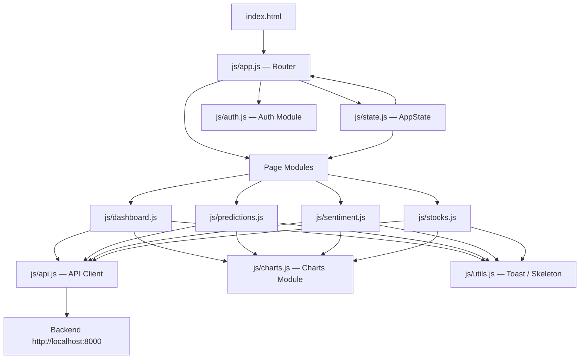

# Design Document: stock-sentiment-frontend

## Overview

MarketMind AI is a pure vanilla HTML/CSS/JavaScript single-page application (SPA) that delivers sentiment-powered stock price predictions through a dark glassmorphism UI. The application communicates with a Python aiohttp backend at `http://localhost:8000` and requires no JavaScript framework — all routing, state management, and rendering are implemented from scratch.

The SPA uses hash-based routing (`#/route`) so the browser never performs a full page reload. A central `AppState` object acts as the single source of truth, shared across all page modules. Chart.js 4 handles all data visualisations. JWT tokens are stored in `localStorage` under the key `mm_token` and attached to every authenticated API request.

### Key Design Goals

- Zero framework dependency — plain ES modules only
- Consistent glassmorphism dark theme matching `design.html`
- Responsive across mobile (<768 px), tablet (768–1024 px), and desktop (>1024 px)
- Graceful degradation: skeleton loaders while fetching, error toasts on failure
- Auto-refresh price data every 30 seconds on the dashboard

---

## Architecture

The application follows a layered architecture with clear separation between routing, state, API communication, and page rendering.



### Module Responsibilities

| Module | File | Responsibility |
|---|---|---|
| Router | `js/app.js` | Hash change listener, route → page mapping, auth guard |
| AppState | `js/state.js` | Central state object, subscriber pattern for symbol changes |
| Auth Module | `js/auth.js` | Register, login, logout, JWT read/write |
| API Client | `js/api.js` | `fetch` wrapper, auth header injection, error normalisation |
| Charts Module | `js/charts.js` | Chart.js instance lifecycle, theme defaults |
| Utils | `js/utils.js` | Toast notifications, skeleton helpers, date formatting |
| Dashboard | `js/dashboard.js` | Dashboard page init, polling, AI agent chat |
| Predictions | `js/predictions.js` | Predictions page init, train model action |
| Sentiment | `js/sentiment.js` | Sentiment page init, analyze action |
| Stocks | `js/stocks.js` | Stocks page init, collect data action, pagination |

### Routing Flow

```mermaid
flowchart TD
    Start([hashchange / load]) --> Guard{JWT in localStorage?}
    Guard -- No --> PublicRoute{Route is /login or /register?}
    PublicRoute -- Yes --> RenderPublic[Render public page]
    PublicRoute -- No --> RedirectLogin[Redirect to #/login]
    Guard -- Yes --> KnownRoute{Route recognised?}
    KnownRoute -- No --> RedirectDash[Redirect to #/dashboard]
    KnownRoute -- Yes --> LoadPage[Fetch page HTML fragment]
    LoadPage --> InjectDOM[Inject into #app-content]
    InjectDOM --> InitModule[Call page module init()]
```

---

## Components and Interfaces

### File Structure

```
frontend/
├── index.html                  # Single entry point
├── pages/
│   ├── dashboard.html
│   ├── predictions.html
│   ├── sentiment.html
│   ├── stocks.html
│   ├── history.html
│   ├── profile.html
│   ├── login.html
│   └── register.html
├── css/
│   ├── main.css                # Global styles, glassmorphism tokens
│   ├── dashboard.css           # Dashboard-specific layout
│   ├── components.css          # Reusable component styles
│   └── responsive.css          # Media query breakpoints only
├── js/
│   ├── app.js                  # Router + bootstrap
│   ├── state.js                # AppState singleton
│   ├── api.js                  # HTTP client
│   ├── auth.js                 # Authentication flows
│   ├── charts.js               # Chart.js wrappers
│   ├── utils.js                # Toast, skeleton, helpers
│   ├── dashboard.js
│   ├── predictions.js
│   ├── sentiment.js
│   └── stocks.js
└── assets/
    └── (icons, images)
```

### index.html Shell

`index.html` provides the persistent layout shell. Page content is injected into `#app-content`.

```html
<body>
  <div id="app-shell">
    <aside id="sidebar"><!-- nav links --></aside>
    <div id="main-wrapper">
      <header id="top-bar"><!-- symbol search, hamburger --></header>
      <main id="app-content"><!-- page fragments injected here --></main>
    </div>
  </div>
  <div id="toast-container"></div>
</body>
```

### Router Interface (`js/app.js`)

```js
// Route map
const ROUTES = {
  '/dashboard': { page: 'pages/dashboard.html', module: () => import('./dashboard.js'), auth: true },
  '/predictions': { page: 'pages/predictions.html', module: () => import('./predictions.js'), auth: true },
  '/sentiment':   { page: 'pages/sentiment.html',   module: () => import('./sentiment.js'),   auth: true },
  '/stocks':      { page: 'pages/stocks.html',       module: () => import('./stocks.js'),       auth: true },
  '/history':     { page: 'pages/history.html',      module: null,                              auth: true },
  '/profile':     { page: 'pages/profile.html',      module: null,                              auth: true },
  '/login':       { page: 'pages/login.html',        module: () => import('./auth.js'),         auth: false },
  '/register':    { page: 'pages/register.html',     module: () => import('./auth.js'),         auth: false },
};

// Public API
navigate(hash: string): void       // programmatic navigation
getCurrentRoute(): string          // returns active route key e.g. '/dashboard'
```

### AppState Interface (`js/state.js`)

```js
const AppState = {
  currentSymbol: 'AAPL',          // string
  currentUser:   null,            // User object | null
  token:         null,            // string | null
  priceData:     [],              // StockData[]
  sentimentData: [],              // SentimentResult[]
  predictions:   [],              // Prediction[]
  activeRoute:   '/dashboard',    // string

  // Methods
  setSymbol(symbol: string): void,          // updates + notifies subscribers
  subscribe(callback: Function): Function,  // returns unsubscribe fn
  setToken(token: string | null): void,     // syncs with localStorage
  setUser(user: object | null): void,
};
```

### API Client Interface (`js/api.js`)

```js
// Base URL constant
const BASE_URL = 'http://localhost:8000';

// Generic request — attaches Bearer token if present
async function request(method, path, body = null): Promise<any>

// Convenience wrappers
async function get(path): Promise<any>
async function post(path, body): Promise<any>

// Domain helpers
const api = {
  auth: {
    register(data),
    login(data),
    logout(),
  },
  stocks: {
    price(symbol),
    data(symbol, start, end),
    indicators(symbol),
    collect(symbols, days),
  },
  sentiment: {
    get(symbol),
    analyze(symbol),
  },
  predictions: {
    get(symbol, days),
    train(symbol),
    history(symbol),
    backtest(symbol),
  },
  symbols: {
    search(query),
  },
  agent: {
    query(text),
  },
};
```

### Charts Module Interface (`js/charts.js`)

```js
// Destroy existing instance before re-render (prevents canvas reuse errors)
destroyChart(id: string): void

// Chart factory functions — all apply dark theme defaults
createLineChart(id, labels, datasets, options = {}): Chart
createBarChart(id, labels, datasets, options = {}): Chart
createScatterChart(id, datasets, options = {}): Chart

// Theme defaults applied to every chart
const CHART_DEFAULTS = {
  backgroundColor: 'transparent',
  gridColor: '#1e1f2a',
  tickColor: '#9ca3af',
  tooltipMode: 'index',
};
```

### Utils Interface (`js/utils.js`)

```js
// Toast notifications
showToast(message: string, type: 'success' | 'error', duration?: number): void

// Skeleton helpers
showSkeleton(containerId: string, rows?: number): void
hideSkeleton(containerId: string): void

// Date helpers
formatDate(dateStr: string): string          // 'YYYY-MM-DD' → 'Mar 1, 2026'
daysAgo(n: number): string                   // returns ISO date string n days ago
today(): string                              // returns today's ISO date string

// Number helpers
formatPrice(n: number): string              // → '$213.45'
formatPercent(n: number): string            // → '+2.34%'
colorClass(n: number): string               // → 'positive' | 'negative' | 'neutral'
```

### Navigation Layout

The sidebar and top bar are rendered once in `index.html` and remain persistent across route changes. Active route highlighting is applied by the router after each navigation.

```
Desktop (>1024px):   [Sidebar full] | [Top bar + content]
Tablet (768-1024px): [Sidebar icons] | [Top bar + content]
Mobile (<768px):     [Top bar + hamburger] / [Drawer overlay]
```

---

## Data Models

These are the JSON shapes returned by the backend and consumed by the frontend modules.

### User
```json
{
  "id": 1,
  "email": "user@example.com",
  "username": "alice",
  "full_name": "Alice Smith",
  "is_active": true,
  "created_at": "2026-04-01T10:00:00"
}
```

### StockData
```json
{
  "date": "2026-04-01",
  "open": 210.50,
  "high": 215.00,
  "low": 209.80,
  "close": 213.45,
  "volume": 52000000,
  "adj_close": 213.45
}
```

### SentimentResult
```json
{
  "date": "2026-04-01",
  "avg_sentiment_score": 0.142,
  "article_count": 12,
  "positive_count": 7,
  "neutral_count": 3,
  "negative_count": 2
}
```

### Prediction
```json
{
  "target_date": "2026-04-02",
  "predicted_price": 213.45,
  "confidence_score": 0.72,
  "trend_direction": "up",
  "model_source": "local"
}
```

### PredictionHistory
```json
{
  "id": 1,
  "prediction_date": "2026-04-01",
  "target_date": "2026-04-02",
  "predicted_price": 213.45,
  "actual_price": null,
  "confidence_score": 0.72,
  "trend_direction": "up",
  "model_source": "local"
}
```

### BacktestResult
```json
{
  "symbol": "AAPL",
  "count": 45,
  "mae": 1.234,
  "rmse": 1.892
}
```

### SymbolSearchResult
```json
{
  "symbol": "AAPL",
  "company_name": "Apple Inc.",
  "exchange": null
}
```

### AppState Shape (in-memory only)

```js
{
  currentSymbol: string,       // e.g. 'AAPL'
  currentUser:   User | null,
  token:         string | null,
  priceData:     StockData[],
  sentimentData: SentimentResult[],
  predictions:   Prediction[],
  activeRoute:   string,       // e.g. '/dashboard'
}
```

---

## Correctness Properties

*A property is a characteristic or behavior that should hold true across all valid executions of a system — essentially, a formal statement about what the system should do. Properties serve as the bridge between human-readable specifications and machine-verifiable correctness guarantees.*

### Property 1: Route rendering completeness

*For any* valid route in the ROUTES map, when the URL hash is set to that route, the router should inject the corresponding page fragment into `#app-content` and the previous page content should no longer be present.

**Validates: Requirements 1.2, 1.3**

---

### Property 2: Routing auth guard

*For any* hash value (recognised or not), when no valid JWT is present in `localStorage`, the router should redirect to `#/login` for protected routes and to `#/login` for unrecognised routes; when a valid JWT is present and the hash is unrecognised, the router should redirect to `#/dashboard`.

**Validates: Requirements 1.4, 1.5**

---

### Property 3: Login token round-trip

*For any* successful login response containing a token, the Auth Module should store that exact token in `localStorage` under `mm_token`, update `AppState.token` to the same value, and redirect to `#/dashboard`.

**Validates: Requirements 2.5, 16.3**

---

### Property 4: Logout clears all auth state

*For any* authenticated session, after the logout action completes, `localStorage` should contain no `mm_token` key, `AppState.token` should be `null`, `AppState.currentUser` should be `null`, and the active route should be `#/login`.

**Validates: Requirements 2.7, 16.4**

---

### Property 5: Bearer token on all authenticated requests

*For any* API Client request made while `AppState.token` is non-null, the outgoing `fetch` call should include an `Authorization: Bearer <token>` header whose value matches `AppState.token` exactly.

**Validates: Requirements 2.8**

---

### Property 6: Page data rendered from API response

*For any* symbol and any page that fetches data on load (dashboard, predictions, sentiment, stocks, history), the values rendered in the DOM should match the values returned by the corresponding mocked API response — no truncation, rounding, or substitution beyond formatting.

**Validates: Requirements 3.2, 3.3, 3.4, 5.1, 6.1, 7.1, 8.1**

---

### Property 7: Dashboard shows only five most recent history records

*For any* prediction history response containing N records (N ≥ 5), the dashboard history table should render exactly 5 rows corresponding to the 5 most recent entries by `prediction_date`.

**Validates: Requirements 3.8**

---

### Property 8: Error toast on non-200 API response

*For any* API Client call that returns a non-200 HTTP status, the application should display a red toast containing the server's error message string, and the affected card or table should remain in its last known state (not blank).

**Validates: Requirements 3.10, 5.5, 6.4**

---

### Property 9: Symbol search triggers API after 2 characters

*For any* input string of length ≥ 2 typed into the symbol search field, the API Client should call `GET /symbols/search?q=<input>` within 300 ms of the last keystroke; for any input string of length < 2, no search API call should be made.

**Validates: Requirements 4.2**

---

### Property 10: Symbol selection updates AppState and notifies subscribers

*For any* symbol selected from the search dropdown, `AppState.currentSymbol` should be updated to the selected symbol, all registered subscriber callbacks should be invoked with the new symbol, and the current page should reload with the new symbol's data.

**Validates: Requirements 4.3, 16.2**

---

### Property 11: Sentiment bar chart color mapping

*For any* `avg_sentiment_score` value, the bar chart color assigned by the Charts Module should be green (`#10b981`) when score > 0.1, amber (`#f59e0b`) when −0.1 ≤ score ≤ 0.1, and red (`#ef4444`) when score < −0.1.

**Validates: Requirements 6.2**

---

### Property 12: Client-side table sorting correctness

*For any* table dataset and any column, clicking the column header once should sort the rows in ascending order by that column's value; clicking again should sort in descending order; the full dataset should be present after sorting (no rows dropped or duplicated).

**Validates: Requirements 8.2**

---

### Property 13: JWT payload decode renders profile fields

*For any* valid JWT stored in `localStorage`, the Profile Page should decode the payload and render the `username`, `email`, and `created_at` fields; the rendered values should match the decoded payload exactly.

**Validates: Requirements 9.1**

---

### Property 14: Active route nav item highlighted

*For any* route navigation, the sidebar navigation item whose path matches the current route should have the active CSS class applied, and no other navigation item should have that class simultaneously.

**Validates: Requirements 10.5**

---

### Property 15: Toast auto-dismiss timing

*For any* success toast, it should be removed from the DOM after 3 seconds; *for any* error toast, it should be removed after 5 seconds. Both timings should be measured from the moment the toast is inserted into the DOM.

**Validates: Requirements 12.1, 12.2**

---

### Property 16: Skeleton lifecycle round-trip

*For any* API Client request, a skeleton placeholder should be present in the target container while the request is in flight; once the request resolves (success or failure), the skeleton should be replaced — with actual content on success, or with an error message on failure.

**Validates: Requirements 13.1, 13.2, 13.3**

---

### Property 17: Dashboard price polling interval

*For any* active dashboard session, the API Client should call `GET /stocks/{symbol}/price` at least once every 30 seconds after the initial load call, and should stop calling when the user navigates away from the dashboard.

**Validates: Requirements 3.5**

---

### Property 18: Chart destroy before re-render

*For any* chart ID, calling `destroyChart(id)` followed by creating a new chart with the same ID should succeed without throwing a canvas reuse error; calling `destroyChart` on a non-existent ID should be a no-op.

**Validates: Requirements 15.5**

---

### Property 19: Chart tooltip mode

*For any* chart created by the Charts Module, the Chart.js options should include `plugins.tooltip.mode = 'index'` and `plugins.tooltip.intersect = false`.

**Validates: Requirements 15.4**

---

## Error Handling

### API Errors

All API errors are normalised in `js/api.js` before reaching page modules:

```js
// api.js error normalisation
async function request(method, path, body) {
  try {
    const res = await fetch(BASE_URL + path, { ... });
    if (!res.ok) {
      const data = await res.json().catch(() => ({}));
      throw new ApiError(res.status, data.error || 'An unexpected error occurred');
    }
    return res.json();
  } catch (err) {
    if (err instanceof ApiError) throw err;
    throw new ApiError(0, 'Network error — check your connection');
  }
}
```

Page modules catch `ApiError` and call `showToast(err.message, 'error')`. The affected card is left in its last known state (skeleton is replaced with the previous content or an inline error message).

### Auth Errors

| Scenario | Behaviour |
|---|---|
| 401 on login | Toast "Invalid credentials", clear `mm_token` |
| 400 on register | Toast with server error message |
| 401 on any authenticated request | Clear token, redirect to `#/login` |
| Expired/missing JWT on protected route | Redirect to `#/login` before page load |

### Network Errors

If `fetch` throws (offline, CORS, DNS failure), the error is caught and normalised to `ApiError(0, 'Network error — check your connection')`. The same toast + last-known-state pattern applies.

### Chart Errors

`destroyChart(id)` is always called before creating a new chart instance. If the canvas element is not found, the function logs a warning and returns without throwing.

### Empty Data States

| Page | Empty condition | UI response |
|---|---|---|
| Stocks | `GET /stocks/{symbol}/data` returns empty array | "No data available — click Collect Data to fetch records" |
| Symbol search | `GET /symbols/search` returns empty results | "No symbols found" in dropdown |
| History | No prediction records | Empty table with "No predictions yet" row |

---

## Testing Strategy

### Dual Testing Approach

Both unit tests and property-based tests are required. They are complementary:

- **Unit tests** verify specific examples, integration points, and edge cases
- **Property tests** verify universal correctness across many generated inputs

### Property-Based Testing

**Library**: [fast-check](https://github.com/dubzzz/fast-check) (JavaScript/TypeScript PBT library)

Each property test must run a minimum of **100 iterations** and be tagged with a comment referencing the design property:

```js
// Feature: stock-sentiment-frontend, Property 2: Routing auth guard
fc.assert(fc.property(fc.string(), (randomHash) => {
  // ... test body
}), { numRuns: 100 });
```

**Property test coverage** (one test per property):

| Test | Property | Description |
|---|---|---|
| `router.route-rendering.test.js` | Property 1 | All routes render correct page fragment |
| `router.auth-guard.test.js` | Property 2 | Auth guard redirects correctly for all hash values |
| `auth.login-round-trip.test.js` | Property 3 | Login stores token in localStorage and AppState |
| `auth.logout.test.js` | Property 4 | Logout clears all auth state |
| `api.bearer-header.test.js` | Property 5 | Bearer token attached to all authenticated requests |
| `pages.data-render.test.js` | Property 6 | Page data matches API response values |
| `dashboard.history-limit.test.js` | Property 7 | Dashboard shows only 5 most recent history records |
| `api.error-toast.test.js` | Property 8 | Error toast shown for any non-200 response |
| `search.debounce.test.js` | Property 9 | Search API called after 2+ chars, not before |
| `state.symbol-selection.test.js` | Property 10 | Symbol selection updates AppState and notifies subscribers |
| `charts.sentiment-color.test.js` | Property 11 | Sentiment bar color mapping correctness |
| `history.sort.test.js` | Property 12 | Client-side sorting correctness for all columns |
| `profile.jwt-decode.test.js` | Property 13 | JWT payload fields rendered correctly |
| `nav.active-highlight.test.js` | Property 14 | Active nav item highlighted for any route |
| `utils.toast-timing.test.js` | Property 15 | Toast auto-dismiss timing (3s success, 5s error) |
| `utils.skeleton-lifecycle.test.js` | Property 16 | Skeleton replaced on request completion |
| `dashboard.polling.test.js` | Property 17 | Price polling fires every 30 seconds |
| `charts.destroy-rerender.test.js` | Property 18 | Chart destroy + re-render no canvas errors |
| `charts.tooltip-mode.test.js` | Property 19 | Chart tooltip mode set to index |

### Unit Test Coverage

Unit tests focus on specific examples, edge cases, and integration points:

- **Auth flows**: Registration form validation, login form validation, 400/401 error handling
- **Symbol search**: Empty results display, blur-without-selection restores symbol
- **Stocks page**: Empty data state message, collect data toast content
- **Predictions page**: Train model loading indicator, backtest metrics display
- **Sentiment page**: Analyze Now refresh behavior
- **Navigation**: Hamburger toggle, sidebar collapse at tablet width
- **Charts**: Price history chart datasets, sentiment oscillator datasets
- **AppState**: Initial field values, token/user null on init

### Test Environment

- **Test runner**: [Vitest](https://vitest.dev/) (run with `vitest --run` for single execution)
- **DOM environment**: `jsdom` (via Vitest's `environment: 'jsdom'` config)
- **Mocking**: `vi.fn()` for API calls, `vi.useFakeTimers()` for polling and toast timing
- **PBT library**: `fast-check` (install: `npm install --save-dev fast-check`)

### Running Tests

```bash
# Single run (CI)
npx vitest --run

# Watch mode (development)
npx vitest
```
